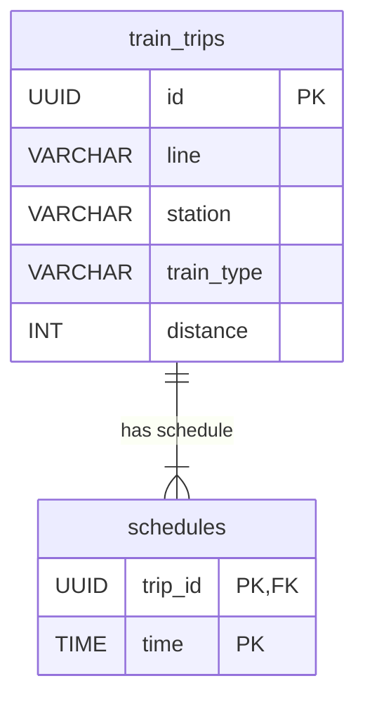

**Note on the Diagram:**

*   The `train_trips` table now has a simple `id` as its Primary Key (PK).
*   The `schedules` table uses a composite Primary Key (`trip_id`, `time`).
*   The `trip_id` in `schedules` is also a Foreign Key (FK) that points to the `id` in `train_trips`.
*   The `||--|{` relationship denotes that one `train_trip` can have many `schedules`.